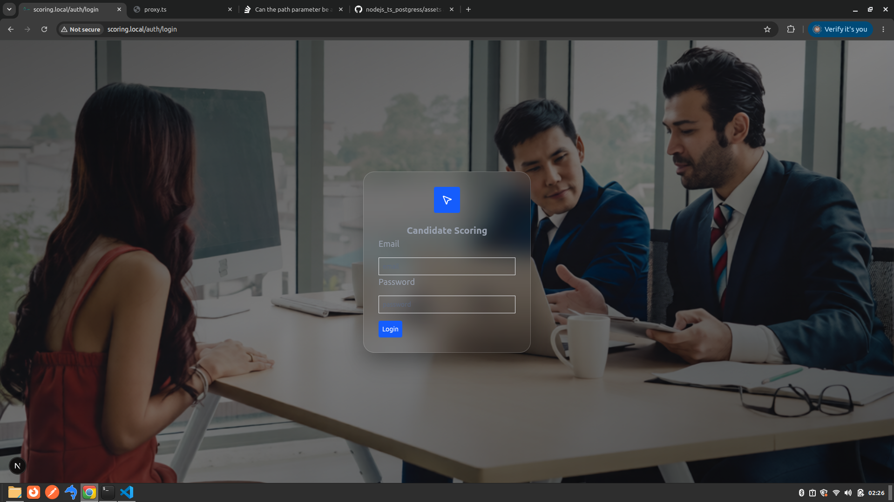
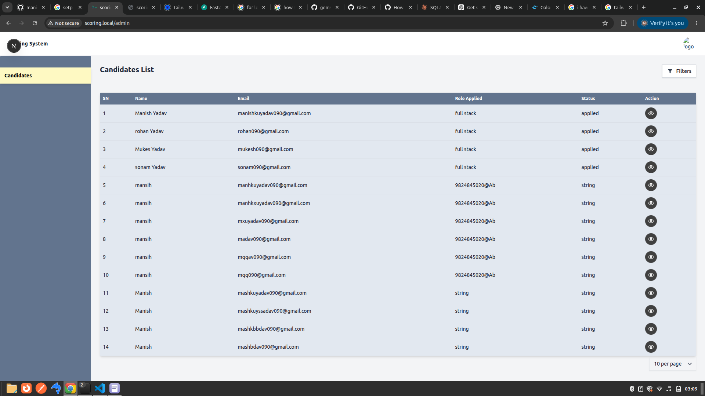
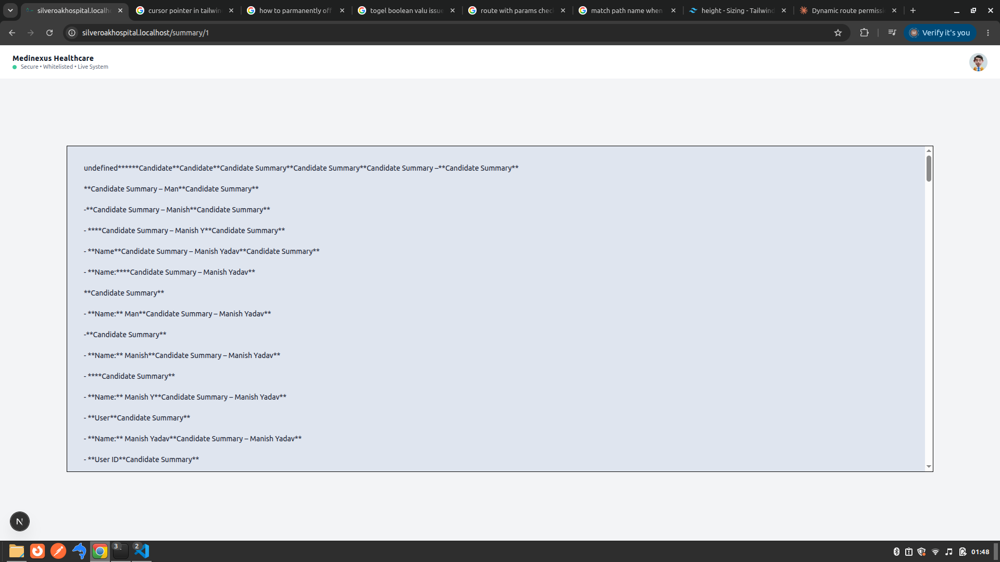
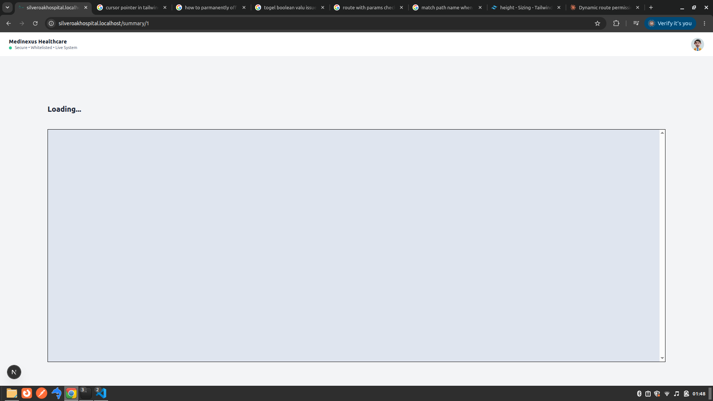

###   Used Stack  ####

- FastApi
- Next js
- Type script
- Docker

###  Cookies Based Authentication  ####
- Used server side cookies base authentication so the fontend and backend need to be on same domain . 
- It have used virtual host on my local.
- It help to prevent from xss and csrf

##   Api Enpoints build  ##

- register
- login
- candidate details
- submit score for other candidate
- view own score as reviewer
- LLM Summary  (using ollama)

##  DataBase migrations
 - candidates
 - scores
 - users

 ##  Docker ###

 - Backend on  8000
 - Frontend on 5173

 # How to run this project using docker (recommended) because of cookies based authentication
   - docker compose build
   - docker compose up
   - go to sudo nano /etc/hosts
   - add 127.0.0.1 scoring.local

 # How to run this project
    #  Backend 
    - python3 venv venv on root folder of backend 
    - pip install -r requirements.txt
    - copy .env.example to .env 

    # npm i 
    # npm run dev

 
# Credential

  # admin 
   - email : rose@gmail.com
   - password : 9824845020@Ab

   
   
   
      
   

   

 
 